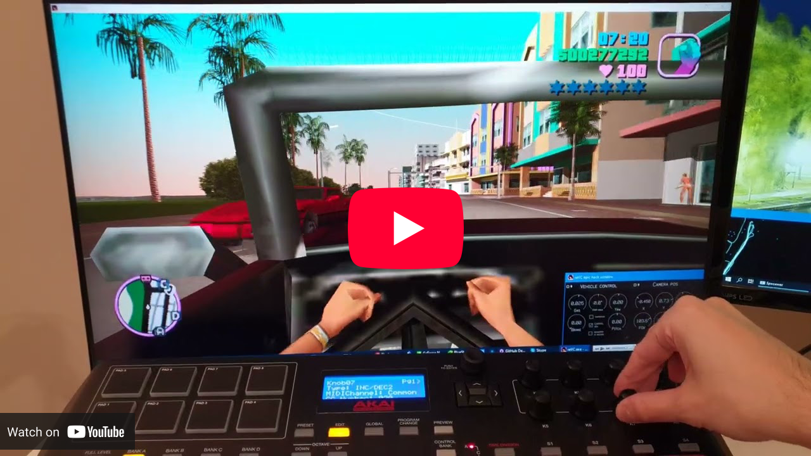

:toc:

++++

  

++++

My fork of reVC with my own edits. The original reVC is all about recreating the original game and adding a minimum of fixes, this fork is all about changing more things, adding cool things, and ruining both the reVC codebase and the original experience with nonsense. Let's see what I did.

++++

  

++++

== What I fixed or added

Most of my modifications are indicated by a `// rouz edit` comment in the code. You can see the bulk of my modifications in https://github.com/Photosounder/ViceCity/commit/d5103c6eca84606d002f22365364a8b4e21fdd66[this single commit].

=== Fixes
* I changed how the mouse cursor is handled and hidden (on Windows) so that running the game either in a window or full screen and switching to other programs works correctly. Also switching to other programs doesn't bring up the menu automatically, so the game can keep running in the background.
* The FOV in reVC is actually too large with widescreen fixes, so I hardcoded a FOV reduction. It should probably depend on the aspect ratio, but I currently use a fixed ratio.

++++

  

++++

* I increased the far clip plane to avoid annoying visible clipping (mostly at high altitudes) and modified librw (only in the D3D9 renderer) so that the fog remains the same. More is needed to be done to improve how the game looks from high altitudes.
* I changed the centering of the camera on foot to be lower so we can better see what we stand on.
* With one little addition I was able to have two different levels of camera closeness when on foot.
* I fixed firing rockets on foot while moving fast (like being atop a fast moving vehicle) so that it's safe to fire rockets in any direction while using my remote controlled car cheat.

++++

  

++++

* I fixed ped spawning when there are many cars. Without my fix when calculating how many peds exist the game correctly avoids counting car passengers but does count drivers, so if there are many drivers then no ped on the street would spawn. I fixed that by counting the number of drivers myself and taking that into account when deciding to create new peds. I also added a multiplier to easily have fewer or more peds.
* I also hated how while driving a car pressing the keys to pitch up or down would make the camera move up or down, so I've disabled the camera movement based on such keyboard inputs.
* When falling from a height I was tired of the rolling animation always screwing up my landings so I replaced it with an animation of getting up from laying down, this way our ped stays in place.
* I fixed dying police helicopters from spinning too fast and causing infinite loops.
* I fixed wheel rotation values getting too high which caused them to stop spinning at high FPS or have their sizes glitch.

=== Spawning and streaming
* I added a clause that reduces the spawn distance when there are few cars already spawned, so that when you start a new game you'll have a few cars spawning near you.
* I removed some checks to kind of max out the spawning of cars, so there are a lot more cars spawning.
* I added debug messages to know why the random spawning of cars doesn't fully go through.
* I disabled the unloading of many objects, because why should we constantly unload objects then reload them later? Doing so can bring the RAM usage up to about 700 MB, which of course in the 2020s is nothing.
* I increased some limits to try to max out how many models of vehicles and peds can be loaded.

=== Other

++++

  

++++

* I disabled the invisible box around the map that would make you bounce in the other direction, so now you can sail or fly much further away, far enough for water to become invisible and for the game to crash.
* I disabled sliding when standing on a moving vehicle so that we don't constantly slide off when standing on a remote controlled car.
* I disabled losing health from drowning as a ped (but not as a driver). Hopefully I will eventually do more to make water more logical.
* Some of the aforementioned changes are toggled by variables stored in a struct where I put all my original stuff, and they can be disabled in the `rouz_init()` function.
* I incorporated https://github.com/k00lagin/[k00lagin]'s https://github.com/k00lagin/reVC-experiments/commit/fd9cc8638ae31edcf1ebe87856b161bbbc29c9b3[Resume menu button].
* I made some glorious cheats.

== Cheats

Typing cheat codes like `ASPIRINE` is so stupid and annoying. I have a much better system: just press `G` and then some numbers. Also you can repeat the last cheat by pressing `Num+`. Incidentally the old cheat codes are disabled so that you can type these new cheats while driving, meaning that any key that isn't `G` or a number is ignored so you can type a cheat while driving, running or doing anything else.

Also I created some much cooler cheats than the original game had.

=== My original cheats

==== G21 - Full throttle remote car bomb

Enter a car or truck, type G21 like it's a normal cheat, and when you exit the vehicle it will be as if the gas pedal was pushed down while the steering wheel is held straight, as long as the car has an "abandoned" status (meaning no driver). When you press the `B` key on your keyboard (hardcoded) it will explode with the same power as a crashing helicopter. So you can aim your vehicle towards a target, exit it, see your vehicle ram that target and then detonate whenever you choose. If you pop some of the car's tires horror and hilarity ensue as the car spins madly and kills all pedestrians and motorcyclists in its unpredictable path.

==== G22 - Remote controlled car/bike

Enter or stand on a car, truck or bike, type G22, and when not in the driver's seat you can now control the vehicle remotely with the keys `IJKL` (also hardcoded). So you can drive this vehicle while driving another vehicle, or from a distance, or from a passenger seat, or while you stand on top of it, so you can drive a vehicle and fire any weapon at the same time, which makes police chases have a fairly different dynamic. The game will not add to your wanted level if you crash into cops or run people over, however if you're standing on the vehicle then running pedestrians over might make you jump up in the air and off of your controlled vehicle. You can have both G21 and G22 above activated at the same time. In that case it will work as if G22 was activated, but the car will still explode if you press the `B` key.

https://user-images.githubusercontent.com/7466235/124305969-188d6980-db66-11eb-90f0-37dd01bf179a.mp4
++++

  With the G22 cheat you can drive the car you're standing on and do stunts while shooting any gun.

++++

In flying mode (G33) `U` and `O` are also for steering left and right and `;` and `P` are for pitching up and down.

==== G23: Car gets on fire

++++

  

++++

Sets the car's damage to just enough so that it burns. Naturally it will explode after 5 seconds, unless you fix it (G44) or use G23 again (which happens silently).

==== G30 - Physics for all

All vehicles and peds are affected by physics. This is useful in slippery tires mode so that all other cars, even those far away, will use physics mode and therefore also have slippery tires.

==== G31 - Screwy gravity

++++

  

++++

Instead of being attracted to the Earth, all people and vehicles are now mysteriously attracted to a building containing an object a billionth the mass of the Earth. This allows you to orbit this building for as long as air drag allows you and eventually drive on every face of the building all while every other vehicle crashes into it and explodes. Uses an accurate physical simulation of gravity.

==== G32 - OUTTA MY WAY VICE FUCKING SHITS

This time the gravity comes not from a building, but from your vehicle! Also it's actually antigravity, so everybody who gets close to you gets repelled. You can drive at full speed and never have to worry about hitting another car, as all will be forming a big high speed exploding mess in front of you.

++++

  

++++

G31 and G32 do work together, their effects are combined.

==== G33 - Flying vehicle

It mainly allows you to fly in a car, bike or boat. I'm quite proud of my flight simulator code, it has air density that decreases with altitude, both an horizontal and lateral simulated plane (plus a smaller plane in the third axis for front drag), a simulated tail that keeps your vehicle going with the flow laterally and forward thrust that decreases with speed. Stall isn't simulated though so vehicles fall down like a feather. Also works together with G31 and G32. It also works in water which allows you to use any remote controlled vehicle as a boat. Flying boats behave weirdly above water.

++++

  

++++

See my explanation of the atmosphere and flight thrust windows for how flight characteristics can be controlled.

==== G34 - Lower gravity

Makes gravity be only 70% of normal gravity.

==== G35 - Tony Hawk's Pro Skater mode

I really thought to myself "driving normally is boring, I'd rather have Tony Hawk's Pro Skater but with cars instead of a skateboard". Requires the use of a num keypad, so laptop users probably can't enjoy that one.

- `Num0`: Boost forward speed by about 20 km/h.
- `Num5`: Jump as soon as enough wheels touch the ground.
- `Num6` + `A` or `D`: Flat spin left or right.
- `Num4` + `A` or `D`: Spin left or right like a kickflip or heelflip.
- `Num4` + `S` or `W`: Backflip or frontflip.

++++

  

++++

A sort of ollie is best achieved by a jump quickly followed by a backflip which will make the tail of the car hit the ground and then later a frontflip to level the car. This allows jumping higher than a normal flat jump. Boosting with `Num0` can also help with jumping over taller obstacles, and with boost and flips you can control your car kind of like a rocket.

==== G36 - Slippery tires

My new favourite cheat. Driving with normal tires is so boring, this makes tires only have 20% as much force from friction. This applies to all cars, not just yours, but currently doesn't apply to bikes (it could but I just haven't done it yet).

==== G41 - Flip vehicle

Makes your vehicle horizontal while conserving its heading and stops it from spinning if in mid-air. Also applies to your remote controlled vehicle.

==== G42 - Enter as passenger

++++

  

++++

You'll enter the nearest car as passenger. Seems to only work if your vehicle is remote controlled (G22). Then you can drive/fly around with the `IJKL` controls, with the added benefit that the engine will be quiet.

==== G43 - Glue to vehicle

Glue yourself to the car you're standing on. You'll be hovering at a fixed height above your vehicle's centre and this can be a problem when flying because the car can hit your body if you don't fly level.

++++

  

++++

==== G44 - Fix and resurrect yourself and your vehicle

This restores your health, the health and body of either the vehicle you're in or your remote controlled vehicle. It can also bring that vehicle back from the dead as well as bring you back from the dead whether you got shot, ran over, exploded or busted by the police. It currently cannot resurrect you if you died while driving. Also resurrection doesn't always work and can even get your game stuck on a grey screen or make the game crash because the ways of GTA are mysterious.

==== G45 - Teleport yourself onto the roof of your vehicle

Works when you're inside the vehicle or if you have a remote-controlled vehicle.

==== G46 - Teleport yourself and your vehicle up 60 metres

Useful for taking flight easily or getting out of a bad place. If you're outside of a vehicle but have a remote controlled vehicle (G22) then both the car and you as a ped will be teleported up.

==== G47 - Regenerative health

Slowly regenerate your body's health according to the Gaussian function. When you get hit the timer resets to the middle of the upside down Gaussian function so that it progressively transitions back to full health. Regenerative health gets disabled if you use G44, so if you do you have to use G47 to turn it back on. If you die while G47 is on you will spawn with almost zero health but it will regenerate.

==== G510 to G516 - Set wanted level

Type G51 and the wanted level you want.

==== G520 to G526 - Set maximum wanted level

Type G52 and the maximum wanted level you want.

==== G53 - No ambulances

Toggle whether or not ambulances can spawn.

==== G611 - Remove weapons

Removes all your weapons.

==== G612 - Remove armour

Removes your armour.

==== G01 - Unlimited traffic generation

++++

  

++++

This unlocks traffic generation so it's much denser than usual by removing the usual limits on how many random vehicles can be spawned. Only affects vehicles, not peds.

==== G02 - Clean bike backflips

I always wanted to be able to do clean backflips without being rotated upright halfway through the flip. This allows you to do that. It has the side effect that if your wheels aren't on the ground you need to somehow get them on the ground again to restore your balance and drive normally again.

++++

  

++++

==== G03 - Can't fall off bike

Now you can't fall off your bike for any reason, yay! Currently makes you bugged if you get jacked, which if I recall correctly can be fixed by doing G45. If you do something that would have thrown you off your bike you will still take some health damage.

==== G04 - Lock doors

Lock car doors so no one can remove you from the car. But then you also can't get out unless you unlock the doors also with G04. You can use G45 to teleport yourself on top of the car. Peds inside the car can still get out though, this doesn't lock them in.

++++

  

++++

==== G05 - Prevent vehicle despawn

This stops the car from disappearing if you put it somewhere and then go far away. But if you set it as your remote controlled car and you go far away it will fall through the ground and disappear.

==== G06 - Ghost town

Almost no car appears on the roads, peds still appear normally.

++++

  

++++

==== G07_ - Set the weather

- G070: Default weather
- G071: Sunny weather
- G072: Extra sunny weather
- G073: Hurricane

=== Restored cheats from the original (mostly)

==== G11 - SEAWAYS

++++

  

++++

Drive your car on water.

==== G12 - KANGAROO

Jump super high on foot.

==== G13 - Riot mode (FIGHTFIGHTFIGHT + OURGODGIVENRIGHTTOBEARARMS, I think)

Pedestrians get weapons and attack you and cars drive dangerously. Cannot be toggled off.

++++

  

++++

==== G14 - GREENLIGHT

Traffic lights are always green.

==== G15 - Peds attack paramedics

Peds get guns and attack cops and paramedics. Well, they don't do a very good job of attacking cops, not sure why, but they do a good job of attacking paramedics.

++++

  

++++

== Cool cheat combinations

=== Try these

==== G41 + G44 - Fix yourself

The most essential combination of cheats, flip your burning car with G41 and fix it with G44. If you're in a bad place you car also use G46 to teleport yourself way up and with G35's flips you can orient yourself in a direction then use `Num0` to boost yourself there.

==== G22 + G33 + G45 - Sail on a car

++++

  

++++

Cars that fell into water normally float uselessly. But now by enabling remote control (G22) and standing on top of your car (G45) the flight mode (G33) can be used to slowly thrust your car as it floats on water, so you can use this to sail all around the map. Naturally you can also use this to pick a fight with other boats by shooting at them with your guns and even jump onto other boats to commandeer them.

==== G31 + G32 - Fight gravity on the road

G31 removes Earth's gravity in favour of a building's gravity, G32 brings it back. Well, it also adds repelling cars, but what can you do. You could use G34 instead of G32 but that makes Earth's gravity weaker.

Anyway the point of combining those two is that when you drive by that building that has the G31 gravity you have to fight it, the Earth's gravity if only going to keep you on the road if you drive fast enough and don't hit anything.

==== G31 + G33 - Fight gravity in the air

If only that building attracts you gravitationally you can also attempt to evade its grip by flying away. If you fly off from the building itself you will need to fly in a spiral to slowly get away from the building.

==== G36 + G30 + G35 - Drift around and jump over obstacles

G36 and G30 make all cars drift around, and G35 enables jumping, so that when you drift towards an oncoming car you car just jump over it to maintain your momentum. Instead of jumping you could also use G06 or G32 to make sure no car gets in your way. G35 also allows reorienting your car (with `Num6` + `A` or `D`) to fix your heading quickly and `Num0` can give you the sudden thrust needed to adjust your trajectory, so that you're not just drifting but also kind of handling your car like a rocket.

Adding G515 (5 star wanted level) is an interesting variant because FBI cars will drift towards you at high speed, and with G35 you can jump and/or tilt your car backwards so that when FBI cars hit you it throws you high in the air, and then by doing flips (also with G35) do cool tricks to land on your wheels.

==== G13 + G47 + G06 + G53 + G520 - Survive the madness

G13 makes the peds armed and violent towards each other and you, G47 is regenerative health so that you have to manage your health (avoid fights when close to death to recover), G06 removes cars so that you will be alone against the peds with no easy way out, G53 removes ambulances so that they won't bother you (maybe this could be replaced by G15 to make peds attack paramedics instead, but then they won't be as aggressive towards you), and G520 means the cops won't bother you as you kill your way out of this mess.

Maybe G36 could be added to make any car you might find both harder to drive and easier for peds to jack.

==== G23 + G21 - Time car bomb

G23 sets your car on fire which gives it 5 seconds until it explodes, while G21 makes it drive away straight without a driver (only if G22 is off). So you can turn on G21 in your car, aim your car at your target, set your car on fire with G23, exit your car at the right moment and watch it drive away and explode, hopefully also taking out your enemies. Adding G36 makes it drive away more slowly, which could be a good thing if your enemies aren't far away.

==== G43 + G06 + G14 + G47 - Map the roads

++++

  

++++

Jump on a car driven by an NPC, glue yourself to it with G43, make sure other cars don't get in the way with G06, get rid of red lights with G14 and just to be safe turn on regenerative health with G47 if case riding on top of the car gets you hurt, and voilà, the car will drive on random roads and given enough time (which can be helped by setting the time scale to the max in the epic hack window) you will obtain a good map of the roads of Vice City in the hack window.

== Epic hack window

++++

  

++++

A second window pops up when you launch my version of the game. You can minimise it or even close it (this won't quit the game) if you don't need it. It creates a map of where you've been, plus it shows objects as blue circles and other peds as smaller orange circles. Also it contains windows, some immediately visible, some stored in an area off-screen, that have functions.

=== The cheats window

It only contains the time scale, which is how you can set the time scale. Note that while the max is supposedly 24x in reality it's more like 10x.

=== Camera position window

This one only does something if you're in a vehicle and using the first person camera mode. It allows you to control where the camera is located inside or outside the car, it also allows you to set the field of view (narrow fields of view can make you motion sick more easily btw) and how close to the camera objects get clipped, which can be good for removing your ped's face from your view. Sadly when it comes to bikes the camera doesn't move freely in all axes, I don't know why.

++++

  

++++

=== Vehicle control

These controls allow you to control a vehicle using this window and these knobs. This might seem like a strange thing to do but this gives you a rather pleasant approach to driving, one where you can swerve smoothly, control your trajectory as you slalom between cars more finely, drive at a reasonable speed and where flooring it is rather scary. I know it sounds clunky, and it kind of is, but it's genuinely a fairly unique and pleasant - and dare I say immersive - experience.

The way this normally works is that you get in a car, set it the camera mode to first person view, adjust the camera's position, either to be inside the ped's head, in the passenger seat, in the middle or even in the back seat, then place the hack window over the game window, adjust it so that it's small enough to only obscure an uninteresting part of the game like the interior of the car or a seat, then enable "Control veh", control "Steer angle" with your mouse (by holding down on the left mouse button and moving it up and down to steer right or left, sounds awkward but it doesn't feel so awkward to me) and use the mouse scroll where to control the gas in increments. `S` can be pressed to suddenly set "Gas" to 0 and brake.

Most of the time, to avoid driving at a mad speed, you want "Gas" to be around 0.08, but you can bring it as high as 0.3 to climb a challenging slope, or about 0.15 for a few seconds to get up to speed from a stop. "Gas" has quirks due to how it works in the game. A value very slightly above 0 or even below 0 will allow you to keep your momentum whereas a value of exactly 0 will be like pressing no key in the normal game which slows down your car more significantly. You can slow down using a negative gas, but of course you'll have to be careful to bring it to 0 once you're done slowing down to avoid backing up, and negative gas isn't like braking, it's more like reverse thrust.

"Handbrake" and "Brake" are what you'd expect, as are "Yaw" and "Pitch" for flight mode (G33), except that setting yaw and pitch this way is so unintuitive that it makes staying in the air extremely challenging (and not in a fun way, just a challenging way).

"Keyboard is master" uses key input from the window, but due to how I programmed it to slowly turn the steering wheel it's not very pleasant to use.

"MIDI control" is made to drive using physical knobs from a MIDI keyboard, which is quite interesting to use.

ifdef::env-github[]

endif::[]

ifndef::env-github[]
video::D67jxy7AHV8[youtube]
endif::[]

=== Atmosphere and flight thrust windows

The formula for air density as a function of altitude, `exp(-max(0, z-26) / 1200)`, essentially an exponential function with a scale and a limit for maximum density, is defined in my "epic hack window" in a window north of the main view, which can be accessed by entering the zoom-scroll mode by clicking the middle mouse buttom, zooming out and moving north. The default formula is fairly realistic except in how it scales with altitude, except that a more realistic formula would replace the `1200` with about 10000 to make the atmosphere scaled more normally, but that would be boring in the game to flight so far above the map that it disappears before feeling the effects of low air denstiy.

++++

  

++++

The point of exposing that formula is of course to have fun. Fun ideas include things like making the density overall lower so that higher speeds are required to maintain enough lift, making the air thin out abruptly to create a sort of invisible interface between air and vacuum, which could then be exploited by increasing "thrust in vacuum" to gain greater speeds while on a ballistic uncontrolled trajectory in the vacuum, or even add periodic gaps in the air to make a band of thick air above our altitude challenging to reach, or just make air extra dense to allow flying very slowly.

Another small window below it allows modifying the vehicle's thrust, the first knob decides of the thrust power, the second one, "zero thrust speed", makes thrust decrease the closer you get to a given speed so it functions as a sort of speed limit, the idea being that a propeller can't give you much thrust if your forward speed is close to the speed at which it can propel air backwards, and the third one can be used to decide how thrust is dependent on air density (0 would be like a normal plane, 1 would be like a rocket).

By default the air density and thrust are configured so that cars fly like a small propeller plane, although air density thins out about 8 times quicker with altitude than in real life. But modfifying thrust and density can create interesting flight characteristics. For instance which higher thrust and lower air density we can fly in a way that feels more like a fighter jet and there's a sweet spot where suddenly pulling up at a certain speed with low enough density without thrust will look like a Pugachev cobra maneuvre, and recovering from this maneuvre with higher than normal thrust will feel right. High thrust but low "zero thrust speed" gives you all the thrust you need to avoid falling down at low speed while effectively limiting your top speed (outside of a dive) to either prevent you from going too fast or making staying level difficult by giving you just enough maximum speed, while low thrust can give you a nice challenge in terms of building up speed and altitude.

== Installation

You need a normal Windows install of GTA Vice City, then download my latest release from the https://github.com/Photosounder/ViceCity/releases[Releases section] and put `reVC.exe` in your GTA Vice City folder and launch it.

If you want to compile it yourself you'll need to put my library https://github.com/Photosounder/rouziclib[rouziclib] somewhere and make sure the compiler finds it.
